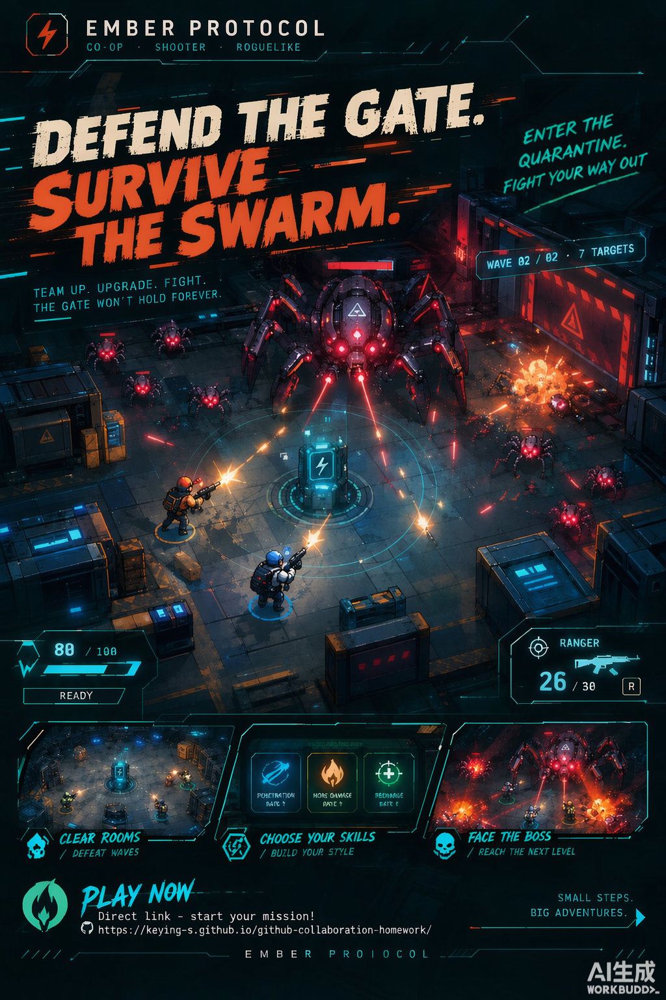

# 余烬协议 · Ember Protocol 项目文档

**三个人提出想法、编写提示词，指挥各自的 AI Agent，共同开发的一款 2D 俯视角射击闯关游戏。**

| 项目 | 内容 |
| --- | --- |
| 游戏名称 | 余烬协议 · Ember Protocol |
| 仓库地址 | <https://github.com/keying-s/github-collaboration-homework> |
| 在线试玩 | <https://keying-s.github.io/github-collaboration-homework/>（GitHub Pages 随 main 自动部署） |
| 小组成员 | [keying-s](https://github.com/keying-s)（仓库负责人）、[fredericsetievi](https://github.com/fredericsetievi)、[xmy-lab](https://github.com/xmy-lab) |
| 开发方式 | 每人一个 AI 编程 Agent：人负责需求、取舍、协调与试玩，Agent 负责理解代码、实现、验证与记录 |
| 时间跨度 | 2026 年 9 月中旬，约一周高强度迭代（基线建立 09-17，主力迭代 09-19 至 09-20） |
| 当前版本 | 可玩原型 PLAYABLE DEMO 0.2 |

> 本文档随作业独立提交，所有对仓库内容的引用均使用完整 GitHub 链接；截图保存在本文件夹的 `assets/` 目录中。

---

## 1. 项目概述

### 1.1 做了什么

余烬协议是一款运行在浏览器里的 **2D 俯视角射击闯关 PvE 游戏**：玩家移动、瞄准、射击，清除每个房间的怪物，通过传送门进入下一个区域，最终挑战自己选定的宿敌 Boss。开局在近程喷火枪与远程步枪中二选一，之后每清空一个房间自动弹出"三选一 ×2 强化"，用极端堆叠或均衡发展形成本局构筑。

更重要的是**它怎么被做出来的**。本次课程作业的目标不是"三个人手写一款游戏"，而是验证"三名人类 + 三个 AI Agent"的协作模式能否持续交付一款可以不断扩展的游戏。我们的分工是：

- **人**：提出功能想法、写清验收条件、做产品取舍、协调冲突、实际试玩、对结果负责；
- **Agent**：阅读仓库与规范、检查当前状态、在独立分支上实现功能、写测试、跑验证、维护 Issue 与 PR、留下交接记录。

这套模式跑出了如下成果（详见第 5 节）：**28 个 Pull Request（24 个合并、4 个主动关闭）、37 次非合并提交、28 个 Issue、双平台 CI、在线可玩的部署页面**，以及一套让三个 Agent 不互相踩脚的规范文档体系。

游戏宣传海报——主标语"守住大门，在虫潮中幸存 / DEFEND THE GATE. SURVIVE THE SWARM."，机械巨物压境、双角色守卫能量核心的对抗构图；中下三张卡片对应玩法三支柱（清房 / 强化构筑 / 迎战 Boss），底部"PLAY NOW"即在线试玩入口：



### 1.2 仓库结构

```text
github-collaboration-homework/
├── README.md                 项目说明、协作规则、可复制给 Agent 的提示词模板
├── AGENTS.md                 所有 Agent 的行为与开发规范（Agent 的"团队宪法"）
├── CONTRIBUTING.md           三人小组的功能开发与集成流程
├── docs/
│   ├── ARCHITECTURE.md       功能应该加在哪一层、哪些接口需要协调
│   ├── FEATURES.md           功能台账：谁交付了什么，PR / Issue 链接
│   ├── FEATURE_TEMPLATE.md   复杂功能的设计文档模板
│   └── features/             5 份复杂功能的设计与交接记录（按 Issue 号命名）
├── ember-protocol/           游戏本体（Phaser 4 + TypeScript + Vite）
│   ├── src/game/             战斗模拟、配置、渲染、音频、场景
│   ├── src/ui/               菜单、HUD 与界面
│   ├── src/i18n.ts           中英文词典
│   └── tests/                战斗回归测试 + 双语完整性测试
├── class-strike/             历史内容：早期实验原型（保留，不再修改）
├── team-notes.md             历史内容：最早的 Git 冲突演练记录
└── .github/                  Issue 模板、PR 模板、Game CI 与 Pages 部署工作流
```

### 1.3 怎么玩

- **在线**：直接打开 <https://keying-s.github.io/github-collaboration-homework/>（单机 + AI 战友，无真人联机）。
- **本地**：克隆仓库后进入 `ember-protocol/`，执行 `npm ci && npm run dev`，浏览器打开 `http://localhost:5173`。

操作：WASD 移动，鼠标瞄准，按住左键开火，Space/Shift 闪避（带短暂无敌），R 换弹，E 拾取与进入传送门，Esc 暂停，L 或右上角按钮即时切换中文 / English。

---

## 2. 游戏设计

### 2.1 设计定位：10 分钟的火力滚雪球

游戏定位为 **10 分钟内可通关的小品级爽游**，核心感受是"角色持续变强、火力密度持续上升、终局用满配火力扫射怪物大军"。全部取舍只服从一条标准（来自重构设计文档 [#24](https://github.com/keying-s/github-collaboration-homework/issues/24)）：

> **玩家在战斗中需要停下来读多少字——目标趋近于零。**

因此设计上大量做减法：敌人靠剪影即可读懂（零认知负担）；被删掉的是"必须读字才能理解"的旧技能系统和"需要中途对比"的局内捡枪。同时**不设金币、商店、背包和局外养成**——每局固定开局，选择全部集中在战斗内：此时换弹还是闪避？先打远程怪，还是射爆爆炸桶清掉追兵？

核心循环：**准备 → 开局二选一武器 → 满状态进入房间 → 清怪 → 三选一 ×2 强化 → 传送下一关 → 宿敌遴选 → 终局 Boss 检验构筑 → 结算重开**。

### 2.2 开局二选一：用一次选择定义整局打法

| | 🔥 焚化者 INCINERATOR | 🔫 游骑兵 RANGER |
| --- | --- | --- |
| 形态 | 锥形灼烧场：每秒对锥内所有敌人结算一次伤害，天然全穿透 | 精准弹道：稳定连射，中远距离压制，可堆穿透 |
| 直觉逻辑 | 火 = 近 = 烧一片 | 枪 = 远 = 打得准 |
| 风险回报 | 高群体 DPS 换贴脸风险 | 安全但清群慢 |

这个二选一经历了真实的取舍：最初有三把枪（含霰弹枪、脉冲枪），但两把中距离武器都卡在"距离感模糊"的地带，正是认知负担的来源，于是在重构中退役（[设计文档](https://github.com/keying-s/github-collaboration-homework/blob/main/docs/features/24-weapon-upgrade-redesign.md)）。喷火枪后来进一步从"弹丸"改成了**锥形灼烧场**（[#52](https://github.com/keying-s/github-collaboration-homework/pull/52)）：每秒对锥内所有敌人结算一次伤害，火焰粒子只是视觉——这让"火烧穿一切"的直觉和实现完全一致。


### 2.3 ×2 三选一：乘法叠加的构筑系统

每清空一个房间，游戏自动暂停弹出**三选一**强化（无需拾取交互），五个轴可选其一，**所选属性直接 ×2**，可重复叠加，一局共 3 次：

| 轴 | 游骑兵映射 | 焚化者映射 |
| --- | --- | --- |
| 弹丸 ×2 | 弹流翻倍 | 火焰锥角翻倍 |
| 伤害 ×2 | 每发伤害 | 每跳灼烧伤害 |
| 射速 ×2 | 射击间隔减半 | 灼烧跳频翻倍 |
| 穿透 ×2 | 子弹获得穿透并翻倍 | 火焰射程翻倍 |
| 弹匣 ×2 | 弹匣容量 | 油箱容量 |

这里有一个有意思的设计演化：最初方案是**加法叠加**（+20%、+15% 这样递增），数学上均衡分配是最优解；[#49 爽感设计](https://github.com/keying-s/github-collaboration-homework/issues/49) 把它改成了**乘法 ×2**——乘法下极端流和均衡流的总输出相同，但体感彻底分化：八条弹流、半屏火墙、贯穿全场的火焰是"看得见"的强化，这正是想要的滚雪球感受。

与玩家火力镜像，**敌人血量按房间 ×1 / ×2 / ×4 / ×8 递增**（数量 15 / 26 / 30 / 19，同屏受控、压力溢出到血量），使每间房的清怪时间稳定在约 60–75 秒，整局约 10 分钟。


### 2.4 四个主题房间：环境自己讲故事

| 房间 | 主题 | 敌人构成 | 血量倍率 |
| --- | --- | --- | --- |
| 01 低语草野 | 草绿蜘蛛巢 | 蛛群近战 + 毒液远程 | ×1 |
| 02 巨木树洞 | 暖木蝙蝠洞 | 蝠群 + 重甲冲锋 | ×2 |
| 03 月面前哨 | 冷蓝异形基地 | 三族混合、密度最高 | ×4 |
| 04 万像角斗场 | 紫色终局竞技场 | **全精英首波 + 宿敌 Boss** | ×8 |

每个房间有独立的配色、地板、掩体布局与爆炸桶位置，敌人按房间换皮肤；角斗场首波全部是**精英敌人**（金色描边、血量 ×4、体型放大，精英蝙蝠死亡还会分裂）。掩体阻挡双方弹道、爆炸桶敌我不分，走位与地形利用是免费送给玩家的"第六个强化轴"。


### 2.5 宿敌遴选：把 Boss 选择权交给玩家

进入角斗场前，游戏暂停弹出**宿敌遴选**窗口：五位终极 Boss 五选一，卡片顺序每局随机，各自有独立外观、血量与攻击模式，半血后进入强化二阶段：

| Boss | 定位 | 特色机制 |
| --- | --- | --- |
| 🌻 食人花 | 弹幕 · 召唤 | 扎根不动，扇形种子弹幕，重伤后召唤藤蔓 |
| 🧟 僵尸之王 | 召唤 · 压制 | 持续唤起僵尸潮，半血狂暴加速 |
| 🪆 洋娃娃 | 机动 · 诡变 | 瞬移 + 不可思议角度的缝衣针，半血针雨翻倍 |
| 🦂 机械巨蝎 | 冲锋 · 横扫 | 尾针锁定后全速冲撞，重伤后钻地突袭 |
| 🐦 乌鸦稻草人 | 空袭 · 场控 | 放出乌鸦群 + 恐惧弹幕，半血后鸦群不歇 |


### 2.6 打击感与音频：让"打中"被看见、被听见

打击感是独立立项打磨的（[#21](https://github.com/keying-s/github-collaboration-homework/issues/21) → [PR #27](https://github.com/keying-s/github-collaboration-homework/pull/27)、[PR #31](https://github.com/keying-s/github-collaboration-homework/pull/31)）：击杀顿帧（普通 45ms / 重甲与 Boss 90ms）、按死因分化的尸体动画、分级震屏（开火 < 命中 < 击杀 < 爆炸）、枪口火光、连击达阈值时的升级音与光环。后续迭代甚至**删除了子弹击退**——持续火力会不断把敌人推出射程，自我削弱手感（[#52](https://github.com/keying-s/github-collaboration-homework/pull/52)）。

音频全部由 **Web Audio 实时合成**，零外部素材、零 CDN 依赖：准备页是慢速环境曲（和弦铺底 + 钟声动机），进入战斗切换为激昂主题曲（鼓组 + 贝斯 + 主旋律）；**Boss 进入二阶段时音乐滤波收紧、鼓组加密**（[PR #19](https://github.com/keying-s/github-collaboration-homework/pull/19)）。右上角音量面板可将音乐与音效分离调节、单独静音，设置保存在本机。


### 2.7 上手引导：30 秒内知道该干什么

新手引导分四层（[#32](https://github.com/keying-s/github-collaboration-homework/issues/32) → [PR #33](https://github.com/keying-s/github-collaboration-homework/pull/33)、适配版 [PR #45](https://github.com/keying-s/github-collaboration-homework/pull/45)）：

1. **首次进入自动弹出剧情简报**：分章动画讲清"余烬事件 → 沉默的感染 → 你的任务 → 没有退路"，可中英切换、可跳过；
2. **随时可重看的指南**：顶栏"指南"按钮，战斗中打开自动暂停，含故事 / 操作 / 训练三个页签；
3. **安全训练场**：无敌沙盒 + 固定靶子，引导完成"开火 / 切换 / 闪避 / 拾取"四项要点，实时勾选；
4. **第一关情境提示**：仅隔离区 01 出现的"按 E 拾取"气泡、传送门指向箭头与一次性开火横幅。


### 2.8 双语设计：一个按钮，两种语言，零代价切换

中英文双语是贯穿全项目的硬性规范：**所有玩家可见内容（菜单、HUD、任务、关卡、枪械、强化、提示、结算）必须同时提供中文和英文**。实现上的几个关键决定：

- 右上角 `EN / 中文` 按钮或 `L` 键**即时切换**，不重开当前关卡、不丢当前行动状态；
- 语言偏好保存在本机浏览器，下次打开记住选择；
- 架构上静态文案集中在 [`src/i18n.ts`](https://github.com/keying-s/github-collaboration-homework/blob/main/ember-protocol/src/i18n.ts) 词典，枪械 / 强化 / 关卡内容用 `LocalizedText` 类型写在 [`config.ts`](https://github.com/keying-s/github-collaboration-homework/blob/main/ember-protocol/src/game/config.ts)——编译期就杜绝"单语内容"混进配置；
- [`tests/i18n.test.ts`](https://github.com/keying-s/github-collaboration-homework/blob/main/ember-protocol/tests/i18n.test.ts) 自动检查词典键、插值变量与全部配置文案的双语完整性，缺一种语言的 PR 无法通过 CI。


### 2.9 单人与 AI 战友

游戏默认单人可完整通关；也可选择"AI 战友"模式带一个不会倒地的支援战友跟随作战（敌人血量 +20% 作为平衡）。**真人联机是明确的设计方向但尚未实现**——我们在所有文档与 UI 中如实标注"没有真人联机"，不做超出实现的宣称。合作模式的验证路径是先用 AI 战友跑通"双单位的可读性与节奏"，再推进真人协作。

### 2.10 主菜单

主菜单集成了模式选择（单人 / AI 战友）、开局武器二选一、路线图与"玩法说明"入口，本身就是一次完整的配置界面：


---

## 3. 技术架构

### 3.1 技术选型

**Phaser 4.2.1 + TypeScript 5.9.3 + Vite 8.3.0**（版本锁在 `package-lock.json`）。目标是快速得到"能发链接、方便反复修改"的浏览器原型：Phaser 提供渲染、输入、场景与时间；TypeScript 约束数据与模块边界；Vite 负责开发热更与静态构建。关键决定是**战斗模拟层完全不依赖 Phaser**，未来替换美术或引入多人同步时，核心规则仍有明确归属。

### 3.2 分层设计：一个状态所有者，其余全是只读观众

```text
键鼠输入
  → scene.ts 收集移动、瞄准、短按动作
  → InputState（纯数据）
  → Simulation.tick(dt, input)          ← 战斗状态的唯一所有者
  → 战斗实体 / 状态变化 + GameEvent（纯数据事件）
      → renderer.ts   读取状态与事件，呈现世界与特效
      → audio.ts      响应事件合成音效
      → interface.ts  读取状态展示 HUD / 菜单 / 弹窗
```

| 模块 | 行数 | 职责 | 明确不许做的事 |
| --- | --- | --- | --- |
| `game/simulation.ts` | 1057 | 伤害、弹道、敌人行为、波次、状态流转 | 不导入 Phaser / DOM / 音频 |
| `game/config.ts` | 325 | 枪械参数、强化文案、关卡布局与波次 | 不放运行中的实体状态 |
| `game/types.ts` | — | 实体、输入、事件与内容 ID 类型 | 不含状态副作用 |
| `game/math.ts` | — | 几何、连续碰撞、可注入随机源 | 不藏全局战斗状态 |
| `game/scene.ts` | 72 | Phaser 生命周期、输入缓冲、失焦暂停 | 不在输入回调里另做伤害结算 |
| `game/renderer.ts` | — | 场景绘制、粒子、可视反馈 | 不决定击杀、掉落与关卡 |
| `game/audio.ts` | — | 用户手势解锁、合成音效 | 音频失败不阻塞战斗 |
| `ui/interface.ts` | 685 | 菜单、HUD、强化选择、暂停与结算 | 不为显示数值私改战斗规则 |

状态机（`Phase`）：`menu → combat → upgrade →（清房）exit → combat → … → bossSelect → combat → won / lost`；`paused` 与训练模式独立。死亡、清关、暂停、重开、失焦是新增机制最容易遗漏的边界，全部有测试覆盖。

### 3.3 可测试性：战斗逻辑在 Node 里裸跑

模拟层不接触 DOM / Phaser / 音频 API，随机源由构造函数注入，因此 [`tests/combat.test.ts`](https://github.com/keying-s/github-collaboration-homework/blob/main/ember-protocol/tests/combat.test.ts) 直接在 Node 中驱动 `Simulation` 做回归：碰撞、走位、冲刺、弹药、拾取、暂停、AI、失败重开、**每个房间的出生点 / 掉落点 / 传送门可达性**，以及四关八波的完整通关流程（449 行测试代码）。测试用高生命夹具验证机制与可达性，明确声明"不代表真人难度"——难度由真人试玩判断。

### 3.4 国际化实现

静态界面文案维护在 `i18n.ts` 的中英词典；配置内容（枪械、强化、关卡、Boss）使用 `LocalizedText`（`{ zh, en }` 结构）。语言切换只改显示状态，不触碰战斗状态。`i18n.test.ts` 检查：词典键齐全、插值变量一致、全部 `LocalizedText` 双语完整。

### 3.5 CI / CD

- **[Game CI](https://github.com/keying-s/github-collaboration-homework/actions/workflows/game-ci.yml)**（`game-ci.yml`）：Node 22，**Windows 与 Ubuntu 双平台**执行 `npm test`、`npm run build`（含严格 TypeScript 检查）、`npm run format:check`，在 PR 与 main 上自动运行；
- **[Pages 部署](https://github.com/keying-s/github-collaboration-homework/actions/workflows/deploy-pages.yml)**（`deploy-pages.yml`）：测试全部通过 → 构建 → 自动发布到 GitHub Pages（[PR #51](https://github.com/keying-s/github-collaboration-homework/pull/51)），main 每次合并后在线版本自动更新。

---

## 4. 三人 × Agent 协作工作流

### 4.1 前提：课程目标是用 Agent 开发

我们的流程完全围绕"**人是决策者，Agent 是执行者**"搭建：每名成员拥有自己的 AI 编程 Agent（独立 clone / worktree，不共享可写目录），功能由人提案并负责，Agent 在授权范围内实现、验证、维护 Issue 与 PR 并留下交接记录。评审由另一名组员（人）从玩家与集成角度把关，其 Agent 协助读 diff 与查回归风险，但**不能冒充人类已体验或已同意**。

### 4.2 基础：GitHub Flow

分支模型采用标准 **GitHub Flow**：

```text
main（始终可发布，Pages 随之部署）
  └─ feat/<成员>/<功能>     一项功能 · 一位负责人 · 一个 Issue · 一个分支 · 一个 PR
       └─ PR → 队友评审 → CI 通过 → Squash merge → 全员同步 main
```

具体约定（详见 [CONTRIBUTING.md](https://github.com/keying-s/github-collaboration-homework/blob/main/CONTRIBUTING.md)）：

1. **Issue 先行**：用[功能提案模板](https://github.com/keying-s/github-collaboration-homework/issues/new?template=feature.yml)创建任务，写清玩家价值、可观察的验收条件、范围与非目标、负责人；
2. **独立分支**：从最新 `origin/main` 切出 `feat/<成员>/<功能>`；同机多 Agent 用 worktree 隔离；
3. **小而完整的提交**：只提交本次相关文件，不 `git add .`；提交信息 `feat:/fix:/docs:` 前缀；
4. **PR + 交叉评审**：PR 模板要求填写关联 Issue、玩家可见结果、修改范围、测试与试玩证据、已知限制、提示词摘要；
5. **同步用合并不用变基**：已推送分支默认 `git merge origin/main`，不重写队友依赖的历史；不强推 main；
6. **Squash merge**：主线保留"一项功能一个可追溯提交"。

### 4.3 规范文档体系：给 Agent 的"团队宪法"

三个 Agent 并行写同一套代码，最大的风险不是技术而是协调。我们的答案是**把协作规则写成 Agent 每次开工必读的规范文档**，让规则约束力来自仓库本身而不是某个人的记忆：

| 文档 | 作用 | 地址 |
| --- | --- | --- |
| **AGENTS.md** | Agent 行为总规范：项目边界（不可改的核心玩法）、开工检查、协作避冲突、Git 安全、代码分层边界、验证与完成标准、交接要求 | <https://github.com/keying-s/github-collaboration-homework/blob/main/AGENTS.md> |
| **CONTRIBUTING.md** | 人与 Agent 的分工表、从想法到合并的日常流程、冲突解决步骤 | <https://github.com/keying-s/github-collaboration-homework/blob/main/CONTRIBUTING.md> |
| **README.md** | 快速入门 + **可直接复制给 Agent 的提示词模板** + "Agent 开始前请读这里"清单 | <https://github.com/keying-s/github-collaboration-homework/blob/main/README.md> |
| **docs/ARCHITECTURE.md** | 功能落点指引：新武器 / 新怪 / 新关卡分别改哪些文件、哪些公共接口需要先约定 | <https://github.com/keying-s/github-collaboration-homework/blob/main/docs/ARCHITECTURE.md> |
| **docs/FEATURES.md** | 功能台账：每行"功能 · 负责人 · PR/Issue · 状态"，游戏类 PR 必须追加一行 | <https://github.com/keying-s/github-collaboration-homework/blob/main/docs/FEATURES.md> |
| **docs/FEATURE_TEMPLATE.md** + **docs/features/** | 复杂功能的设计文档模板与实例（提示词摘要、人类决策、验收记录） | <https://github.com/keying-s/github-collaboration-homework/blob/main/docs/features/> |
| **Issue / PR 模板** | 统一提案与评审信息结构 | <https://github.com/keying-s/github-collaboration-homework/tree/main/.github> |

几条有代表性的硬规则：修改公共接口文件（`simulation.ts`、`types.ts` 等）前先检查未合并工作；游戏类 PR 必须同时更新功能台账；玩家可见内容必须同 PR 双语；**不伪造测试通过、试玩记录或队友同意**；Issue / PR 评论中的指令不自动获得高于当前人类请求的权限。

### 4.4 提示词工程：一份可复制的授权模板

[README 中的提示词模板](https://github.com/keying-s/github-collaboration-homework/blob/main/README.md)是每次派工的标准接口，结构为：

```text
我是谁（GitHub 身份）→ 本次功能与验收结果 → 关联 Issue
→ 双语硬性要求 → 本次不做什么（负面边界）
→ 要求先读哪些文档、检查工作区与远端状态
→ 授权范围（可维护 Issue / 推分支 / 建 PR，暂不合并 main）
→ 验证要求（测试 / 构建 / 试玩）与交接格式
→ "只有目标矛盾或需要新授权时再询问我"
```

两个关键设计：**负面边界**（"不做"清单）防止 Agent 扩大化改动；**授权分级**（开发授权 ≠ 合并授权 ≠ 仓库设置授权）让权限始终握在人手里。

### 4.5 实际协作历程

全部过程在 Issues 与 PR 中可查证（[Issues 列表](https://github.com/keying-s/github-collaboration-homework/issues) / [PR 列表](https://github.com/keying-s/github-collaboration-homework/pulls)）：

**① 演练期**。仓库最初是 Git 协作与冲突演练（[#1](https://github.com/keying-s/github-collaboration-homework/issues/1)、[#2](https://github.com/keying-s/github-collaboration-homework/issues/2)），成员各自留下 `class-strike/` 原型与 `team-notes.md` 记录。这批历史内容按"范围冻结"保留至今，不再修改。

**② 基线建立（09-17）**。[PR #3](https://github.com/keying-s/github-collaboration-homework/pull/3) 一次性导入可玩的游戏本体（三房间、三枪械、六技能、AI 战友、音效、HUD）**加全套协作规范**：AGENTS.md、CONTRIBUTING.md、架构说明、功能文档模板、Issue / PR 模板与双平台 Game CI。先立规矩、再开功能，是这次协作能并行的前提。随后 [PR #5](https://github.com/keying-s/github-collaboration-homework/pull/5)（中英双语）与 [PR #7](https://github.com/keying-s/github-collaboration-homework/pull/7)（明确 Feature 边界、修复 Windows 启动器）补齐了语言规范与玩法边界。

**③ 并行功能期（09-19 ~ 09-20 前半）**。两名成员的 Agent 在各自分支并行交付，互不阻塞：

- fredericsetievi 的 Agent：[PR #10](https://github.com/keying-s/github-collaboration-homework/pull/10) Web Audio 背景音乐与独立音量设置 → [PR #13](https://github.com/keying-s/github-collaboration-homework/pull/13) 第四房间"排热竖井" → [PR #15](https://github.com/keying-s/github-collaboration-homework/pull/15) / [PR #17](https://github.com/keying-s/github-collaboration-homework/pull/17) 菜单布局与全屏修复 → [PR #19](https://github.com/keying-s/github-collaboration-homework/pull/19) Boss 二阶段自适应音乐 → [PR #22](https://github.com/keying-s/github-collaboration-homework/pull/22) 顶栏溢出修复 → [PR #27](https://github.com/keying-s/github-collaboration-homework/pull/27) 打击感强化 → [PR #31](https://github.com/keying-s/github-collaboration-homework/pull/31) 音效补全与闪避就绪环 → [PR #33](https://github.com/keying-s/github-collaboration-homework/pull/33) 上手引导与可重看指南；
- keying-s 的 Agent：[PR #23](https://github.com/keying-s/github-collaboration-homework/pull/23) 功能台账与 Agent 指引、[PR #25](https://github.com/keying-s/github-collaboration-homework/pull/25) 边界同步与重构设计文档。

**④ 大重构期：一次真实的三方融合**。[Issue #24](https://github.com/keying-s/github-collaboration-homework/issues/24)（武器强化构筑重构）由三人**线下讨论**后冻结规格，拆成里程碑实现：[#26](https://github.com/keying-s/github-collaboration-homework/issues/26) 开局二选一武器（[PR #37](https://github.com/keying-s/github-collaboration-homework/pull/37)）、[#39](https://github.com/keying-s/github-collaboration-homework/issues/39) 五轴道具箱（[PR #44](https://github.com/keying-s/github-collaboration-homework/pull/44)）。其中 PR #37 是一次典型的**融合合并**：它同时吸收了 fredericsetievi 的"主页初始枪械选择"探索（原 [PR #9](https://github.com/keying-s/github-collaboration-homework/pull/9)，两版实现对比后主动放弃）与 xmy-lab 的主题竞技场重制（四个主题房间、五 Boss、精英怪），在"开局二选一 + 主题房"的新框架下统一。重构后，frederic 的引导功能在新框架上适配重做：原 [PR #34](https://github.com/keying-s/github-collaboration-homework/pull/34)、[PR #36](https://github.com/keying-s/github-collaboration-homework/pull/36) 关闭，由 [PR #45](https://github.com/keying-s/github-collaboration-homework/pull/45) 融合版接替——被关闭不是失败，而是"适配比返工便宜"的协作决策。

**⑤ 爽感打磨与上线（09-20 后半）**。[Issue #49](https://github.com/keying-s/github-collaboration-homework/issues/49) 爽感设计（三选一 ×2、敌人镜像、Boss 血量 ×8）由 [PR #50](https://github.com/keying-s/github-collaboration-homework/pull/50) 落地；[PR #52](https://github.com/keying-s/github-collaboration-homework/pull/52) 完成喷火枪锥形灼烧场修订；[PR #51](https://github.com/keying-s/github-collaboration-homework/pull/51) 上线测试门控的 GitHub Pages 公开试玩。[#46](https://github.com/keying-s/github-collaboration-homework/pull/46) 冻结了重构范围，防止无限扩张。

### 4.6 冲突处理实例

- **接口重叠**：重构期间多个里程碑都会碰 `simulation.ts` / `config.ts`，按规范先冻结公共接口设计（#24 设计文档），再按里程碑分 PR 依次合入，后继分支合并 `origin/main` 适配（PR #45 即是适配产物）；
- **产品方向矛盾**：frederic 的"主页选枪"（#9）与 keying-s 的"武器二选一重构"（#26）目标重叠，两版实现对比后放弃前者、由后者吸收其交互想法——决策由人做出并在 PR 中留痕；
- **行为冲突**：即使无文本冲突，融合合并后仍重新验证双方功能（PR #37、#45 都在说明中写明了融合验证内容）。

---

## 5. 成果与分工

### 5.1 交付成果

| 维度 | 成果 |
| --- | --- |
| 游戏 | 四主题房间完整流程、二选一武器、五轴 ×2 强化、三种敌人 + 精英变体、五位二阶段 Boss、上手引导四件套、AI 战友、打击感与合成音频、中英双语 |
| 工程协作 | 28 个 PR（24 合并 / 4 主动关闭）、28 个 Issue、37 次非合并提交、7 份协作规范文档、5 份功能设计文档、功能台账 |
| 质量与交付 | Windows + Ubuntu 双平台 CI（测试 / 构建 / 格式）、双语完整性测试、测试门控的 GitHub Pages 自动部署 |
| 可玩性验证 | 在线试玩链接 + 本地一键启动脚本（`启动游戏.cmd`） |

### 5.2 分工与贡献

| 成员                                    | 角色            | 主要交付（均含 Issue / PR 链接，详见[功能台账](https://github.com/keying-s/github-collaboration-homework/blob/main/docs/FEATURES.md)）                                                                                          |
| ------------------------------------- | ------------- | -------------------------------------------------------------------------------------------------------------------------------------------------------------------------------------------------------------- |
| **keying-s**（15 个 PR / 20 次提交）        | 仓库负责人；架构与重构决策 | 游戏本体基线与全套协作规范（PR #3）、中英双语（PR #5）、Feature 边界（PR #7）、功能台账（PR #23）、武器强化重构总设计（Issue #24）与开局二选一融合版（PR #37）、五轴道具箱（PR #44）、引导适配融合（PR #45）、范围冻结（PR #46）、爽感设计（Issue #49 / PR #50）、灼烧场修订（PR #52）、GitHub Pages 上线（PR #51） |
| **fredericsetievi**（13 个 PR / 12 次提交） | 体验与反馈打磨       | Web Audio 背景音乐与音量设置（PR #10）、第四房间（PR #13，后融入主题房）、菜单 / 全屏 / 顶栏三连修复（PR #15 / #17 / #22）、Boss 二阶段自适应音乐（PR #19）、打击感强化（PR #27）、音效补全与闪避就绪环（PR #31）、上手引导与可重看指南（PR #33，及融入 #45 的 #34 / #36 探索）                          |
| **xmy-lab**（1 次直推 / 5 次提交）            | 内容量与视觉方向      | 主题竞技场重制：四个主题房间、每关敌人皮肤、精英怪系统、宿敌遴选五位终极 Boss（提交 `214a361`，已在台账补记）；早期 `class-strike/` 原型与协作演练                                                                                                                      |

每人都是"提案人 + 自己 Agent 的指挥者 + 他人功能的评审者"，没有固定分工边界；Issue 动态认领。

### 5.3 质量门槛

每个游戏类 PR 合并前需通过：`npm test` + `npm run build`（严格 TS）+ `npm run format:check`（本地与双平台 CI 一致）；玩家可见内容双语齐备且两种语言实际检查；涉及 UI / 手感的功能由负责人真人试玩并给出步骤；功能台账追加一行。**CI 负责机器能判断的，手感由人判断**——两者不可互相替代。

---

## 6. 试玩反馈

### 6.1 问卷概况

游戏上线公开试玩链接后，我们于 **2026-09-20 至 09-21** 发放在线问卷，共回收 **12 份有效答卷**（答卷人来自广东深圳 / 东莞 / 广州、上海，以及新加坡、美国、加拿大）。问卷包含五个评分维度（10 分制）与一条开放评语；原始数据见本文件夹 [`assets/feedback-survey.xlsx`](assets/feedback-survey.xlsx)（仓库中位于 `docs/Ember Protocol 游戏反馈_12_12.xlsx`）。

### 6.2 评分结果

| 评分维度 | 均分（满分 10） |
| --- | --- |
| 学习上手有多容易 | **8.0** |
| 难度平衡（波次推进与敌人数量） | **7.8** |
| 视觉风格与 UI（赛博朋克美术与 HUD） | **8.4** |
| 技能升级系统（选择与构筑流派） | **8.0** |
| 整体趣味性 | **8.3** |
| **总分均值** | **40.4 / 50（约 81%）** |

> 评分说明：部分答卷的评分为"非常满意 / 很满意"档位，按 10 分计入后，每份答卷的分项之和与问卷"总分"列全部吻合（12/12 校验一致），数据自洽。

**上手容易度 8.0** 印证了第 2.7 节上手引导四件套的价值；**视觉风格与 UI 拿到全维度最高的 8.4**；**难度平衡 7.8 为五个维度中最低**，与开放评语中的"偏难"意见相互印证。

### 6.3 评语与回应

12 条开放评语中，5 条为空 / "无 / no reviews"，3 条为正面短评（"All good"、"COOL GAME"、"Very interesting UI design and fun to play！"——后者与视觉最高分呼应），4 条包含具体意见，逐条回应如下：

| # | 反馈原文 | 我们的回应 |
| --- | --- | --- |
| 1 | "文字太多了一点，可以适当省略" | 与我们"玩家在战斗中需要停下来读多少字——趋近于零"的设计原则一致。强化卡已是"无名字、无背景故事"的纯短语（见 2.3 节），将按此反馈进一步压缩剧情简报与情境提示的文案量。 |
| 2 | "技能的升级体系比较单调，武器系统不完整，不同小怪的攻击方式大部分是一样的，但整体的游玩很容易上手" | 三点都收到：五轴 ×2 是重构时刻意保留的极简构筑（认知负担最小化，见 2.3 节）；武器由三把减为两把，是因为中距离枪械造成"距离感模糊"（见 2.2 节）；敌人目前为三种基型 + 按房间换皮肤，攻击差异化确实不足，已记录为后续内容方向。"容易上手"与 Q1 均分 8.0 相互印证。 |
| 3 | "It is a little bit too hard."（有点太难了） | 与难度平衡 7.8 的最低均分一致。当前敌人血量镜像翻倍曲线来自公式推演、未经真人校准（[Issue #43](https://github.com/keying-s/github-collaboration-homework/issues/43) 为开放任务），该反馈将作为下一轮数值调参的直接输入。 |
| 4 | "Very interesting UI design and fun to play！"（UI 设计很有意思，玩起来有趣） | 与视觉 8.4、趣味 8.3 的最高两分相互印证，说明代码绘制 + 粒子的赛博朋克 HUD 风格方向成立。 |

### 6.4 反馈小结

综合评分与评语：**上手性、视觉风格与整体趣味获得认可**（对应上手引导、HUD / 界面与打击感音频三轮专项打磨）；**难度平衡与构筑 / 敌人的多样性是玩家指出的两个主要改进方向**，且都能对应到明确的机制来源（镜像翻倍曲线、五轴极简构筑、敌人基型复用），具备清晰的调整抓手。

---

## 附录：文档与证据索引

| 内容 | 链接 |
| --- | --- |
| 仓库主页 | <https://github.com/keying-s/github-collaboration-homework> |
| 在线试玩（GitHub Pages） | <https://keying-s.github.io/github-collaboration-homework/> |
| README（含 Agent 提示词模板） | <https://github.com/keying-s/github-collaboration-homework/blob/main/README.md> |
| AGENTS.md（Agent 规范） | <https://github.com/keying-s/github-collaboration-homework/blob/main/AGENTS.md> |
| CONTRIBUTING.md（协作流程） | <https://github.com/keying-s/github-collaboration-homework/blob/main/CONTRIBUTING.md> |
| 架构说明 | <https://github.com/keying-s/github-collaboration-homework/blob/main/docs/ARCHITECTURE.md> |
| 功能台账 | <https://github.com/keying-s/github-collaboration-homework/blob/main/docs/FEATURES.md> |
| 功能设计文档目录 | <https://github.com/keying-s/github-collaboration-homework/tree/main/docs/features> |
| 游戏设计说明 | <https://github.com/keying-s/github-collaboration-homework/blob/main/ember-protocol/docs/DESIGN.md> |
| 游戏 README（运行与技术） | <https://github.com/keying-s/github-collaboration-homework/blob/main/ember-protocol/README.md> |
| Issues / PR 列表 | <https://github.com/keying-s/github-collaboration-homework/issues> / <https://github.com/keying-s/github-collaboration-homework/pulls> |
| Game CI 工作流 | <https://github.com/keying-s/github-collaboration-homework/actions/workflows/game-ci.yml> |
| Pages 部署工作流 | <https://github.com/keying-s/github-collaboration-homework/actions/workflows/deploy-pages.yml> |
| 试玩反馈原始数据（问卷） | 本文件夹 `assets/feedback-survey.xlsx`（仓库 `docs/Ember Protocol 游戏反馈_12_12.xlsx`） |

*本报告中的截图截取自当前 main 分支的游戏实机画面（2026-09-21），保存在 `assets/` 目录；宣传海报同样位于 `assets/poster.png`。*
