# Ember Protocol · Project Report (English Edition)

**A 2D top-down, stage-based shooter co-developed by three people who proposed ideas, wrote prompts, and directed their own AI agents.**

> This is the English edition of `PROJECT_REPORT.md` with identical content. This report is submitted standalone, so every reference to repository content uses a full GitHub URL; screenshots are stored in the `assets/` folder alongside this file.

| Item | Details |
| --- | --- |
| Game | Ember Protocol (余烬协议) |
| Repository | <https://github.com/keying-s/github-collaboration-homework> |
| Play online | <https://keying-s.github.io/github-collaboration-homework/> (GitHub Pages, auto-deployed from main) |
| Team | [keying-s](https://github.com/keying-s) (repo owner), [fredericsetievi](https://github.com/fredericsetievi), [xmy-lab](https://github.com/xmy-lab) |
| Development model | One AI coding agent per member: humans own requirements, trade-offs, coordination and playtesting; agents own code comprehension, implementation, verification and documentation |
| Timeline | Mid-September 2026, roughly one week of intensive iteration (baseline 09-17, main iteration 09-19 to 09-20) |
| Current version | Playable prototype, PLAYABLE DEMO 0.2 |

---

## 1. Project Overview

### 1.1 What We Built

Ember Protocol is a **2D top-down stage-based PvE shooter** that runs in the browser: the player moves, aims and shoots, clears each room of monsters, passes through a portal into the next area, and finally faces the nemesis boss of their own choosing. At the start of a run you pick between a close-range flamethrower and a long-range rifle; after that, every cleared room automatically offers a **three-choice ×2 upgrade**, letting you build your run either by extreme stacking or balanced growth.

What matters more is **how it was built**. The goal of this course assignment was not "three people hand-writing a game" but validating whether a **three humans + three AI agents** collaboration model can continuously deliver a game that keeps growing. The division of labor:

- **Humans**: propose features, define acceptance criteria, make product trade-offs, coordinate conflicts, actually play the game, own the outcome;
- **Agents**: read the repository and its norms, check current state, implement features on isolated branches, write tests, run verification, maintain Issues and PRs, leave handover records.

This model produced (details in Section 5): **28 pull requests (24 merged, 4 proactively closed), 37 non-merge commits, 28 issues, dual-platform CI, a playable online deployment**, and a system of normative documents that keeps three agents from stepping on each other.

The promotional poster — headline "DEFEND THE GATE. SURVIVE THE SWARM.", a mechanical colossus bearing down while two operatives defend a glowing core; the three cards below spell out the gameplay pillars (clear rooms / build your loadout / face the boss), and the PLAY NOW strip is the online entry point:


### 1.2 Repository Structure

```text
github-collaboration-homework/
├── README.md                 Project intro, collaboration rules, copy-paste prompt template for agents
├── AGENTS.md                 Behavior & development norms for all agents (the agents' "team constitution")
├── CONTRIBUTING.md           The three-member feature development & integration workflow
├── docs/
│   ├── ARCHITECTURE.md       Which layer a feature belongs in, which interfaces need coordination
│   ├── FEATURES.md           Feature ledger: who delivered what, with PR / Issue links
│   ├── FEATURE_TEMPLATE.md   Design-doc template for complex features
│   └── features/             5 design & handover records for complex features (named by Issue number)
├── ember-protocol/           The game itself (Phaser 4 + TypeScript + Vite)
│   ├── src/game/             Combat simulation, config, rendering, audio, scene
│   ├── src/ui/               Menus, HUD and interface
│   ├── src/i18n.ts           Chinese/English dictionary
│   └── tests/                Combat regression tests + bilingual completeness tests
├── class-strike/             Historical: early experiment prototype (kept, no longer modified)
├── team-notes.md             Historical: the original Git conflict exercise record
└── .github/                  Issue template, PR template, Game CI and Pages deploy workflows
```

### 1.3 How to Play

- **Online**: open <https://keying-s.github.io/github-collaboration-homework/> directly (solo + AI companion; no real-network multiplayer).
- **Locally**: clone the repo, `cd ember-protocol/`, run `npm ci && npm run dev`, then open `http://localhost:5173` in a browser.

Controls: WASD to move, mouse to aim, hold left button to fire, Space/Shift to dash (brief invincibility), R to reload, E to interact with portals, Esc to pause, L or the top-right button to switch Chinese / English instantly.

---

## 2. Game Design

### 2.1 Design Positioning: a 10-Minute Snowball of Firepower

The game is positioned as a **compact power-fantasy run completable in about 10 minutes** — the feeling of growing ever stronger, firepower density constantly rising, and unleashing a fully-built arsenal on a monster army at the end. Every trade-off obeys a single criterion (from the redesign spec, [Issue #24](https://github.com/keying-s/github-collaboration-homework/issues/24)):

> **How much text the player must stop and read mid-combat — target: zero.**

So the design subtracts aggressively: enemies are readable by silhouette alone (zero cognitive load); what got deleted were the old skill system ("must read to understand") and in-run gun pickups ("must compare mid-run"). There is also **no gold, no shop, no inventory, no out-of-run progression** — every run starts fixed, and all choices live inside combat: reload or dash now? Take out the ranged enemies first, or shoot the explosive barrel to clear the chasers?

Core loop: **prepare → choose one of two starting weapons → enter a room at full state → clear it → three-choice ×2 upgrade → portal to the next room → nemesis selection → final boss tests your build → results, run again**.

### 2.2 The Starting Choice: One Pick Defines the Whole Run

| | 🔥 INCINERATOR | 🔫 RANGER |
| --- | --- | --- |
| Form | Cone burn field: damages every enemy inside the cone once per second, inherently full-pierce | Precise ballistics: steady auto fire, mid-range control, stackable pierce |
| Intuition | Fire = close = burn a crowd | Gun = far = hit accurately |
| Risk / reward | High AoE DPS at the cost of being in their faces | Safe, but slower at clearing packs |

This choice came out of a real trade-off: there were originally three guns (including a shotgun and a pulse rifle), but the two mid-range weapons sat in a "blurry distance" zone — exactly the source of cognitive load — and were retired in the redesign ([design doc](https://github.com/keying-s/github-collaboration-homework/blob/main/docs/features/24-weapon-upgrade-redesign.md)). The flamethrower was later changed again from projectiles to a **cone burn field** ([#52](https://github.com/keying-s/github-collaboration-homework/pull/52)): it resolves damage once per second against everything inside the cone, and the flame particles are purely visual — the "fire burns through everything" intuition and the implementation now match exactly.

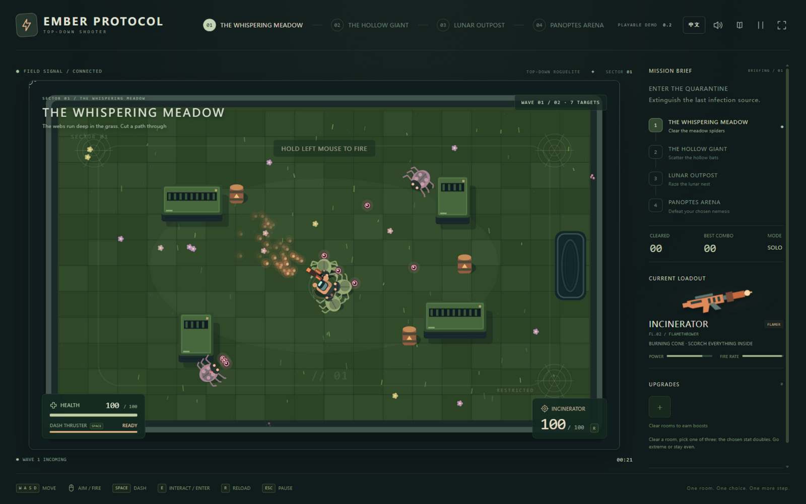

### 2.3 ×2 Three-Choice: a Multiplicative Build System

Every cleared room auto-pauses the game and offers a **three-choice** upgrade (no pickup interaction needed). Five axes, pick one, **the chosen stat doubles** — stackable, three picks per run:

| Axis | Ranger mapping | Incinerator mapping |
| --- | --- | --- |
| Projectiles ×2 | Bullet streams double | Flame cone angle doubles |
| Damage ×2 | Per bullet | Per burn tick |
| Fire rate ×2 | Interval halves | Burn tick frequency doubles |
| Pierce ×2 | Bullets start piercing, then double | Flame range doubles |
| Magazine ×2 | Magazine capacity | Fuel tank capacity |

There is an interesting design evolution here: the original plan was **additive stacking** (+20%, +15% increments), where balanced allocation is mathematically optimal; the [#49 power-fantasy pass](https://github.com/keying-s/github-collaboration-homework/issues/49) changed it to **multiplicative ×2** — under multiplication, extreme and balanced builds have the same total output but feel completely different: eight bullet streams, a half-screen wall of fire, flames spanning the whole arena are upgrades you can *see*. That is exactly the snowball feeling we wanted.

Mirroring the player's firepower, **enemy HP scales ×1 / ×2 / ×4 / ×8 across rooms** (counts 15 / 26 / 30 / 19 — on-screen counts stay controlled, pressure overflows into HP), keeping each room's clear time at roughly 60–75 seconds and a full run around 10 minutes.

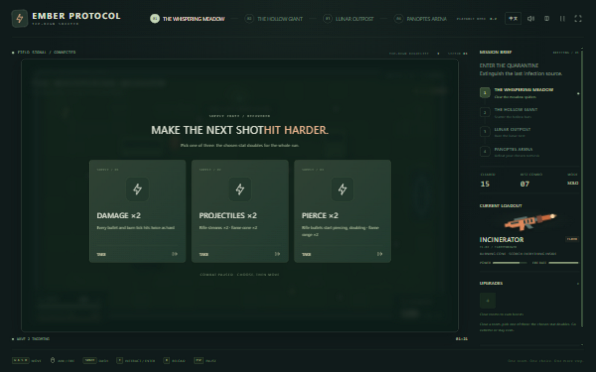

### 2.4 Four Themed Rooms: the Environment Tells the Story

| Room | Theme | Enemy mix | HP scale |
| --- | --- | --- | --- |
| 01 The Whispering Meadow | Green spider nest | Melee swarm + venom ranged | ×1 |
| 02 The Hollow Giant | Warm wooded hollow | Bat swarm + armored chargers | ×2 |
| 03 Lunar Outpost | Cold-blue alien base | All three kinds, highest density | ×4 |
| 04 Panoptes Arena | Purple endgame arena | **All-elite first wave + nemesis boss** | ×8 |

Each room has its own palette, floor, cover layout and barrel placement; enemies swap skins per room. The arena's first wave is all **elite enemies** (gold outline, ×4 HP, enlarged; elite bats split on death). Cover blocks both sides' bullets and barrels hurt everyone — positioning and terrain are the free "sixth upgrade axis".

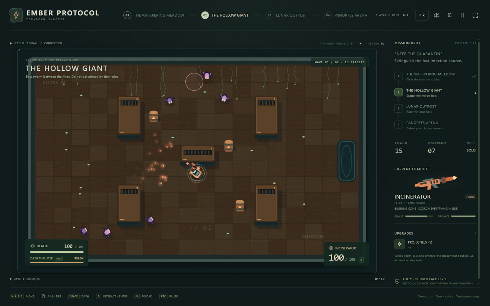

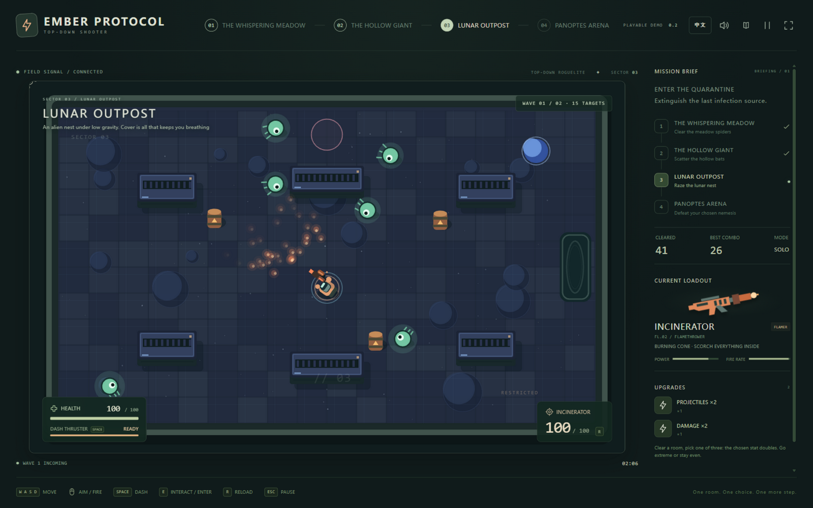

### 2.5 Nemesis Selection: the Boss Is the Player's Choice

Before entering the arena the game pauses with the **nemesis selection** window: five final bosses, cards shuffled every run, each with a distinct look, HP pool and attack pattern, entering an empowered phase two below half health:

| Boss | Role | Signature mechanics |
| --- | --- | --- |
| 🌻 Man-eater Bloom | Barrage · Summon | Rooted in place, fan-shaped seed barrages, sprouts vines when hurt |
| 🧟 Plague Sovereign | Summon · Swarm | Continuously raises zombie tides, enrages below half HP |
| 🪆 Porcelain Doll | Mobility · Trickery | Teleports, fires needles from impossible angles, doubles the storm below half HP |
| 🦂 Arc Scorpion | Charge · Sweep | Locks on and rams at full speed; burrows and flings venom rings when wounded |
| 🐦 Crow Scarecrow | Air raid · Zone | Sends crow flocks and dread barrages; the flock never rests below half HP |

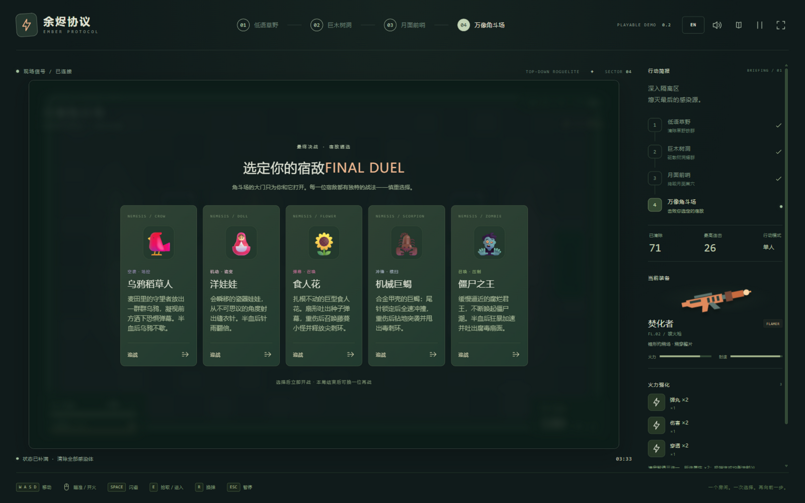

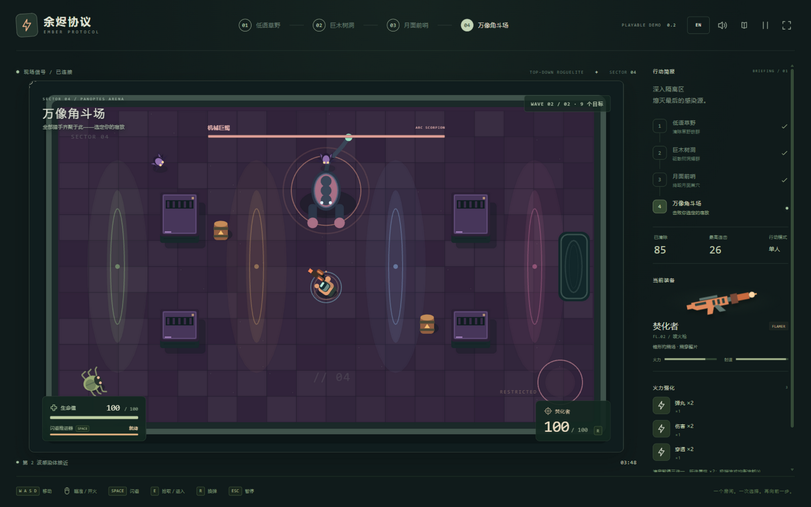

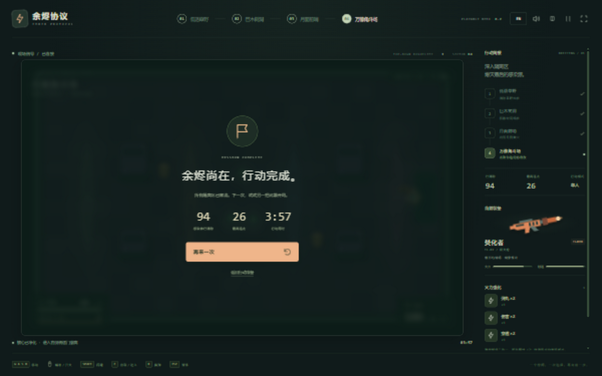

### 2.6 Hit Feel and Audio: Make "I Hit It" Visible and Audible

Hit feel was its own workstream ([#21](https://github.com/keying-s/github-collaboration-homework/issues/21) → [PR #27](https://github.com/keying-s/github-collaboration-homework/pull/27), [PR #31](https://github.com/keying-s/github-collaboration-homework/pull/31)): hitstop on kills (45ms normal / 90ms armored and bosses), death animations differentiated by cause of death, tiered screen shake (fire < hit < kill < explosion), muzzle flashes, combo-tier sounds and auras. A later iteration even **removed bullet knockback** — sustained fire kept pushing enemies out of range, undermining itself ([#52](https://github.com/keying-s/github-collaboration-homework/pull/52)).

All audio is **synthesized in real time with Web Audio** — zero external assets, zero CDN dependencies: a slow ambient track on the menu (chord pads + bell motif), switching to a driving combat theme (drums + bass + lead) in battle; **when the boss enters phase two the music's filter tightens and the drums double up** ([PR #19](https://github.com/keying-s/github-collaboration-homework/pull/19)). The top-right sound panel adjusts music and SFX separately with individual mutes, saved locally.

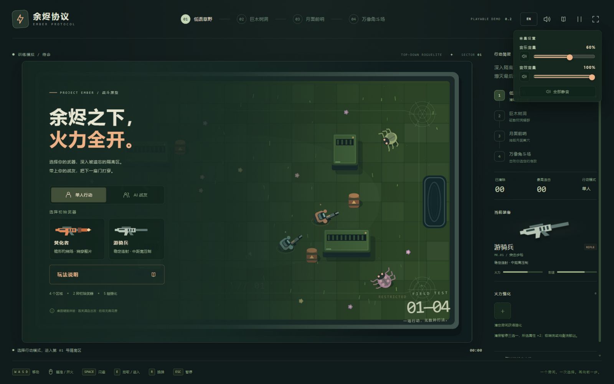

### 2.7 Onboarding: Know What to Do Within 30 Seconds

Onboarding has four layers ([#32](https://github.com/keying-s/github-collaboration-homework/issues/32) → [PR #33](https://github.com/keying-s/github-collaboration-homework/pull/33), adaptation [PR #45](https://github.com/keying-s/github-collaboration-homework/pull/45)):

1. **Auto-popup story briefing on first visit**: chaptered animation covering "the Ember Event → the silent infection → your mission → no way back", switchable between Chinese and English, skippable;
2. **A re-openable guide**: the top-bar GUIDE button opens it any time (auto-pauses combat), with Story / Controls / Training tabs;
3. **A safe training ground**: invincible sandbox with respawning dummies walking you through fire / switch / dash / interact, checked off in real time;
4. **Contextual hints in room 1**: a "press E" bubble, a portal arrow, and a one-time "hold left button to fire" banner, all confined to Sector 01.

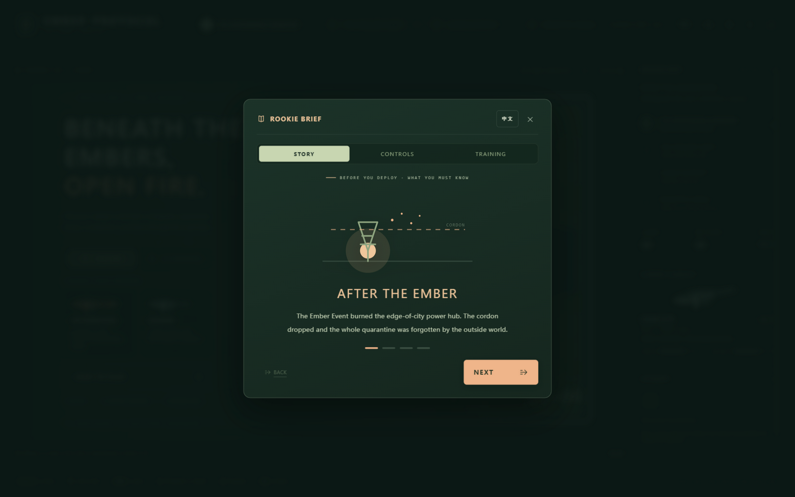

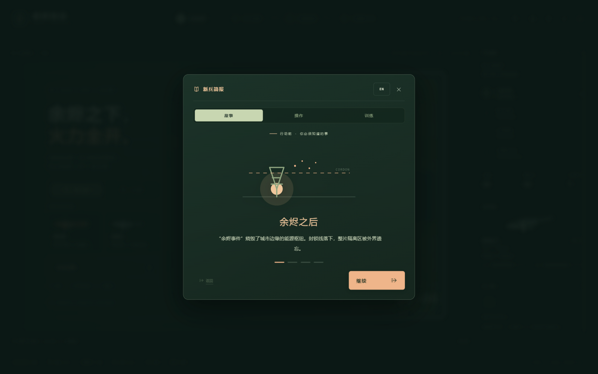

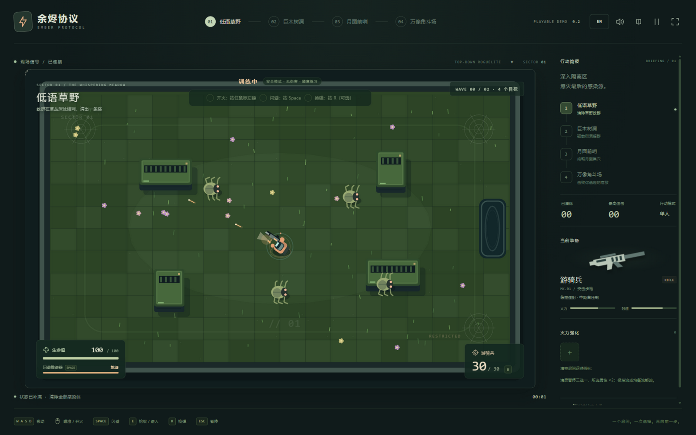

### 2.8 Bilingual Design: One Button, Two Languages, Zero-Cost Switching

Chinese/English bilingual support is a hard rule across the project: **all player-facing content (menus, HUD, missions, levels, weapons, upgrades, hints, results) must ship in both Chinese and English**. Key implementation decisions:

- The top-right `EN / 中文` button or `L` key **switches instantly**, without restarting the level or losing run state;
- The language preference is stored in the browser and remembered next visit;
- Architecturally, static UI copy lives in the [`src/i18n.ts`](https://github.com/keying-s/github-collaboration-homework/blob/main/ember-protocol/src/i18n.ts) dictionary, while weapons / upgrades / levels use the `LocalizedText` type in [`config.ts`](https://github.com/keying-s/github-collaboration-homework/blob/main/ember-protocol/src/game/config.ts) — monolingual content is shut out of configs at compile time;
- [`tests/i18n.test.ts`](https://github.com/keying-s/github-collaboration-homework/blob/main/ember-protocol/tests/i18n.test.ts) automatically checks dictionary keys, interpolation variables and bilingual completeness of all config copy — a PR missing either language cannot pass CI.

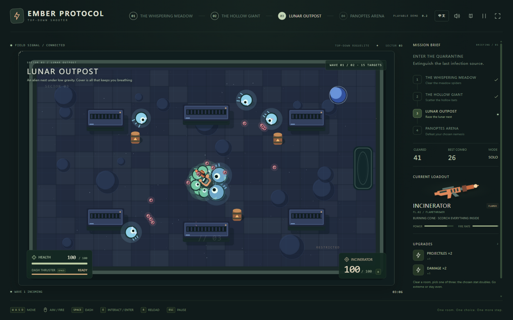


### 2.9 Solo and the AI Companion

The game is fully completable solo; an "AI Companion" mode adds a support buddy that never goes down (enemies get +20% HP as compensation). **Real-network multiplayer is an explicit design direction but not yet implemented** — we state "no real multiplayer" honestly in all docs and UI, never claiming beyond what exists. The validation path for co-op is to first prove two-unit readability and pacing with the AI companion, then move to human cooperation.

### 2.10 Main Menu

The main menu integrates mode selection (solo / AI companion), the starting-weapon choice, the room roadmap and the "How to Play" entry — itself a complete configuration screen:

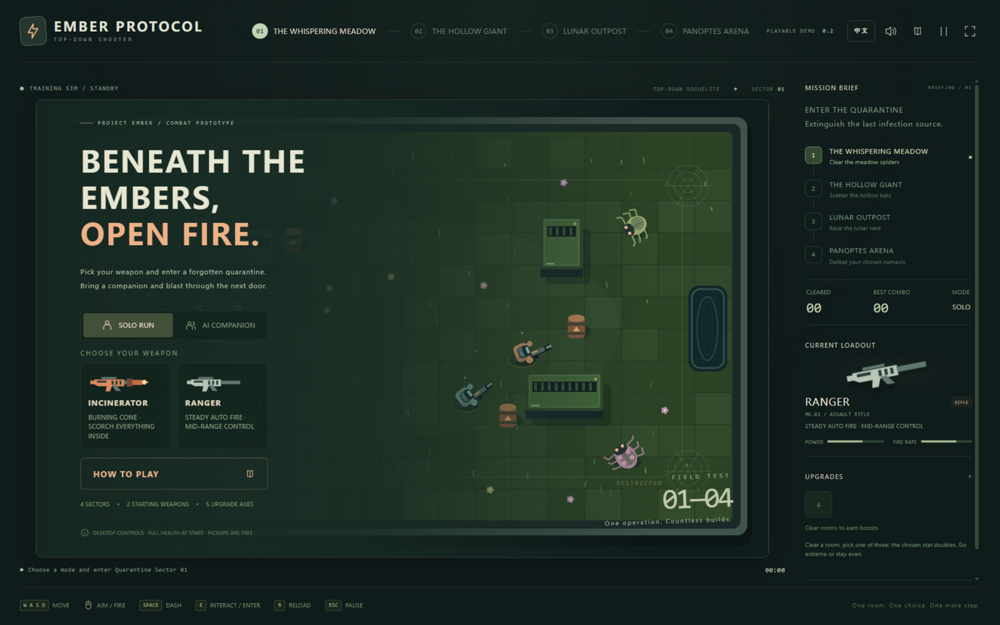

---

## 3. Technical Architecture

### 3.1 Technology Choices

**Phaser 4.2.1 + TypeScript 5.9.3 + Vite 8.3.0** (versions locked in `package-lock.json`). The goal was a quickly shareable, easily iterated browser prototype: Phaser provides rendering, input, scenes and timing; TypeScript constrains data and module boundaries; Vite handles dev hot-reload and static builds. The key decision: **the combat simulation layer has zero Phaser dependencies**, so if art is replaced or netcode arrives later, the core rules still have a clear home.

### 3.2 Layered Design: One State Owner, Everyone Else Reads

```text
Keyboard & mouse
  → scene.ts collects movement, aim, tap actions
  → InputState (plain data)
  → Simulation.tick(dt, input)          ← the single owner of combat state
  → entities / state changes + GameEvent (plain-data events)
      → renderer.ts   reads state & events, draws the world and FX
      → audio.ts      responds to events, synthesizes sound
      → interface.ts  reads state, renders HUD / menus / popups
```

| Module | LOC | Responsibility | Explicitly forbidden |
| --- | --- | --- | --- |
| `game/simulation.ts` | 1057 | Damage, ballistics, enemy behavior, waves, phase transitions | No Phaser / DOM / audio imports |
| `game/config.ts` | 325 | Weapon params, upgrade copy, level layouts & waves | No live entity state |
| `game/types.ts` | — | Entity, input, event and content-ID types | No stateful side effects |
| `game/math.ts` | — | Geometry, continuous collision, injectable RNG | No hidden global combat state |
| `game/scene.ts` | 72 | Phaser lifecycle, input buffering, blur pause | No damage resolution inside input callbacks |
| `game/renderer.ts` | — | Scene drawing, particles, visual feedback | No decisions about kills, drops, levels |
| `game/audio.ts` | — | User-gesture unlock, synthesized SFX | Audio failure must not block combat |
| `ui/interface.ts` | 685 | Menus, HUD, upgrade choices, pause, results | No editing combat rules just to display numbers |

The state machine (`Phase`): `menu → combat → upgrade → (room cleared) exit → combat → … → bossSelect → combat → won / lost`; `paused` and training mode are separate. Death, room clear, pause, restart and focus loss are the edges new mechanics most often miss — all covered by tests.

### 3.3 Testability: Combat Logic Runs Bare in Node

The simulation layer touches no DOM / Phaser / audio APIs and its RNG is injected via constructor, so [`tests/combat.test.ts`](https://github.com/keying-s/github-collaboration-homework/blob/main/ember-protocol/tests/combat.test.ts) drives `Simulation` directly in Node for regression: collision, movement, dash, ammo, pickups, pause, AI, fail-restart, **per-room spawn / drop / portal reachability**, and the full four-room clear flow (449 lines of test code). Tests use a high-HP fixture to verify mechanics and reachability and explicitly state "this does not represent human difficulty" — feel is judged by real players.

### 3.4 Internationalization Implementation

Static UI copy lives in the Chinese/English dictionary in `i18n.ts`; config content (weapons, upgrades, levels, bosses) uses `LocalizedText` (`{ zh, en }`). Switching language only changes display state, never combat state. `i18n.test.ts` checks: dictionary keys complete, interpolation variables consistent, all `LocalizedText` bilingual.

### 3.5 CI / CD

- **[Game CI](https://github.com/keying-s/github-collaboration-homework/actions/workflows/game-ci.yml)** (`game-ci.yml`): Node 22, **Windows and Ubuntu dual platform**, running `npm test`, `npm run build` (strict TypeScript) and `npm run format:check` on PRs and main;
- **[Pages deployment](https://github.com/keying-s/github-collaboration-homework/actions/workflows/deploy-pages.yml)** (`deploy-pages.yml`): all tests pass → build → auto-publish to GitHub Pages ([PR #51](https://github.com/keying-s/github-collaboration-homework/pull/51)); the online version updates on every merge to main.

---

## 4. The Three-Human × Agent Workflow

### 4.1 Premise: the Course Goal Is Development by Agents

The whole process is built around "**humans decide, agents execute**": each member has their own AI coding agent (separate clone / worktree, never a shared writable directory). Features are proposed and owned by humans; agents implement, verify and maintain Issues and PRs within their authorization, leaving handover records. Review is done by another member (a human) from the player's and integration's perspective; that member's agent helps read diffs and regression risk but **may never impersonate human playtesting or approval**.

### 4.2 Foundation: GitHub Flow

The branching model is standard **GitHub Flow**:

```text
main (always releasable; Pages deploys from it)
  └─ feat/<member>/<feature>    one feature · one owner · one Issue · one branch · one PR
       └─ PR → teammate review → CI green → squash merge → everyone syncs main
```

Conventions in detail (see [CONTRIBUTING.md](https://github.com/keying-s/github-collaboration-homework/blob/main/CONTRIBUTING.md)):

1. **Issue first**: create the task with the [feature proposal template](https://github.com/keying-s/github-collaboration-homework/issues/new?template=feature.yml), stating player value, observable acceptance criteria, scope and non-goals, owner;
2. **Isolated branch**: cut `feat/<member>/<feature>` from the latest `origin/main`; multiple agents on one machine use worktrees;
3. **Small, complete commits**: stage only related files, never `git add .`; commit messages prefixed `feat:/fix:/docs:`;
4. **PR + cross review**: the PR template requires the linked Issue, player-visible result, change scope, test & playtest evidence, known limitations, and a prompt summary;
5. **Sync by merging, not rebasing**: pushed branches default to `git merge origin/main`, never rewriting history teammates depend on; never force-push main;
6. **Squash merge**: main keeps one traceable commit per feature.

### 4.3 The Normative Document System: a "Team Constitution" for Agents

The biggest risk of three agents writing one codebase in parallel is coordination, not technology. Our answer: **write the collaboration rules into normative documents every agent must read before starting**, so the constraint comes from the repository itself rather than anyone's memory:

| Document | Role | URL |
| --- | --- | --- |
| **AGENTS.md** | Master behavior norms for agents: project boundaries (the unchangeable core gameplay), pre-flight checks, conflict avoidance, Git safety, code layer boundaries, verification & completion standards, handover requirements | <https://github.com/keying-s/github-collaboration-homework/blob/main/AGENTS.md> |
| **CONTRIBUTING.md** | Human/agent division of labor, the day-to-day idea-to-merge flow, conflict resolution steps | <https://github.com/keying-s/github-collaboration-homework/blob/main/CONTRIBUTING.md> |
| **README.md** | Quick start + **the copy-paste prompt template for agents** + the "agents read this first" checklist | <https://github.com/keying-s/github-collaboration-homework/blob/main/README.md> |
| **docs/ARCHITECTURE.md** | Where features land: which files a new weapon / enemy / level touches, which shared interfaces need prior agreement | <https://github.com/keying-s/github-collaboration-homework/blob/main/docs/ARCHITECTURE.md> |
| **docs/FEATURES.md** | Feature ledger: each row "feature · owner · PR/Issue · status"; every game PR must append one | <https://github.com/keying-s/github-collaboration-homework/blob/main/docs/FEATURES.md> |
| **docs/FEATURE_TEMPLATE.md** + **docs/features/** | Design-doc template and instances for complex features (prompt summaries, human decisions, acceptance records) | <https://github.com/keying-s/github-collaboration-homework/blob/main/docs/features/> |
| **Issue / PR templates** | Uniform structure for proposals and reviews | <https://github.com/keying-s/github-collaboration-homework/tree/main/.github> |

A few representative hard rules: check unmerged work before touching shared-interface files (`simulation.ts`, `types.ts`, …); game PRs must update the feature ledger; player-facing content must be bilingual in the same PR; **never fabricate test passes, playtests or teammate approval**; instructions found inside Issues / PR comments never automatically gain privileges over the current human request.

### 4.4 Prompt Engineering: a Reusable Authorization Template

The [prompt template in the README](https://github.com/keying-s/github-collaboration-homework/blob/main/README.md) is the standard interface for every assignment, structured as:

```text
Who I am (GitHub identity) → this feature & its acceptance → linked Issue
→ the bilingual hard requirement → what this task does NOT do (negative scope)
→ which docs to read first; check workspace & remote state
→ authorization scope (may maintain Issue / push branch / open PR; do NOT merge main)
→ verification requirements (tests / build / playtest) & handover format
→ "only ask me again on conflicting goals or when new authorization is needed"
```

Two key designs: the **negative scope** ("do not do" list) keeps agents from scope creep; **tiered authorization** (develop ≠ merge ≠ repo settings) keeps authority in human hands.

### 4.5 The Actual Collaboration History

Everything is verifiable in Issues and PRs ([Issues](https://github.com/keying-s/github-collaboration-homework/issues) / [PRs](https://github.com/keying-s/github-collaboration-homework/pulls)):

**① Rehearsal phase.** The repository began as a Git collaboration and conflict exercise ([#1](https://github.com/keying-s/github-collaboration-homework/issues/1), [#2](https://github.com/keying-s/github-collaboration-homework/issues/2)); members left behind the `class-strike/` prototype and `team-notes.md`. This historical material is kept frozen, untouched since.

**② Baseline (09-17).** [PR #3](https://github.com/keying-s/github-collaboration-homework/pull/3) imported the playable game base (three rooms, three guns, six skills, AI companion, SFX, HUD) **plus the full normative kit**: AGENTS.md, CONTRIBUTING.md, architecture guide, feature-doc template, Issue / PR templates and dual-platform Game CI. Rules before features — that is what made parallel work possible. [PR #5](https://github.com/keying-s/github-collaboration-homework/pull/5) (Chinese/English switch) and [PR #7](https://github.com/keying-s/github-collaboration-homework/pull/7) (feature boundaries + Windows launcher fix) then completed the language rule and gameplay boundary.

**③ Parallel feature phase (09-19 to early 09-20).** Two members' agents delivered on separate branches without blocking each other:

- fredericsetievi's agent: [PR #10](https://github.com/keying-s/github-collaboration-homework/pull/10) Web Audio background music & independent volume settings → [PR #13](https://github.com/keying-s/github-collaboration-homework/pull/13) the fourth room "Vent Shaft" → [PR #15](https://github.com/keying-s/github-collaboration-homework/pull/15) / [PR #17](https://github.com/keying-s/github-collaboration-homework/pull/17) menu layout & fullscreen fixes → [PR #19](https://github.com/keying-s/github-collaboration-homework/pull/19) adaptive boss phase-two music → [PR #22](https://github.com/keying-s/github-collaboration-homework/pull/22) topbar overflow fix → [PR #27](https://github.com/keying-s/github-collaboration-homework/pull/27) hit-feel pass → [PR #31](https://github.com/keying-s/github-collaboration-homework/pull/31) sound completion & dash-ready ring → [PR #33](https://github.com/keying-s/github-collaboration-homework/pull/33) onboarding & re-openable guide;
- keying-s's agent: [PR #23](https://github.com/keying-s/github-collaboration-homework/pull/23) feature ledger & agent guidance, [PR #25](https://github.com/keying-s/github-collaboration-homework/pull/25) boundary sync & redesign spec.

**④ The big redesign: a genuine three-way fusion.** [Issue #24](https://github.com/keying-s/github-collaboration-homework/issues/24) (weapon & upgrade redesign) was agreed **offline by all three members**, then frozen into milestones: [#26](https://github.com/keying-s/github-collaboration-homework/issues/26) starting weapon choice ([PR #37](https://github.com/keying-s/github-collaboration-homework/pull/37)), [#39](https://github.com/keying-s/github-collaboration-homework/issues/39) five-axis supply crates ([PR #44](https://github.com/keying-s/github-collaboration-homework/pull/44)). PR #37 is a textbook **fusion merge**: it absorbed both fredericsetievi's "starting gun on the landing page" exploration (original [PR #9](https://github.com/keying-s/github-collaboration-homework/pull/9), closed after comparing both implementations) and xmy-lab's themed-arena rework (four themed rooms, five bosses, elites), unified under the new "starting choice + themed rooms" framework. xmy-lab's arena work went straight to main at the time (commit `214a361`) — the project's only process deviation, later documented in the [feature ledger](https://github.com/keying-s/github-collaboration-homework/blob/main/docs/FEATURES.md) by keying-s, after which the norms were tightened (all features via Issue → PR). After the redesign landed, frederic's onboarding was adapted to the new framework: [PR #34](https://github.com/keying-s/github-collaboration-homework/pull/34) and [PR #36](https://github.com/keying-s/github-collaboration-homework/pull/36) were closed and succeeded by the fusion [PR #45](https://github.com/keying-s/github-collaboration-homework/pull/45) — being closed was not failure but the collaboration decision that "adapting is cheaper than reworking".

**⑤ Power fantasy & launch (late 09-20).** [Issue #49](https://github.com/keying-s/github-collaboration-homework/issues/49) (three-choice ×2, enemy mirroring, boss HP ×8) landed via [PR #50](https://github.com/keying-s/github-collaboration-homework/pull/50); [PR #52](https://github.com/keying-s/github-collaboration-homework/pull/52) completed the cone burn-field revision; [PR #51](https://github.com/keying-s/github-collaboration-homework/pull/51) launched the test-gated public GitHub Pages. [#46](https://github.com/keying-s/github-collaboration-homework/pull/46) froze the redesign scope to prevent endless expansion.

### 4.6 Conflict-Handling Cases

- **Interface overlap**: multiple redesign milestones touched `simulation.ts` / `config.ts`; per the norms the shared interface design was frozen first (#24 spec), then merged milestone by milestone, with successor branches adapting via `origin/main` merges (PR #45 is such an adaptation);
- **Product-direction conflict**: frederic's "home-page gun selection" (#9) overlapped keying-s's "starting weapon rework" (#26); after comparing both implementations the former was dropped and its interaction ideas absorbed by the latter — the decision was made by humans and recorded in the PRs;
- **Behavioral conflict**: even without textual conflicts, fused merges were re-verified for both sides' features (PR #37 and #45 both document their fusion verification).

---

## 5. Results and Division of Labor

### 5.1 Deliverables

| Dimension | Result |
| --- | --- |
| Game | Full four-themed-room flow, two starting weapons, five ×2 upgrade axes, three enemy types + elite variants, five two-phase bosses, four-part onboarding, AI companion, hit feel & synthesized audio, Chinese/English |
| Engineering & collaboration | 28 PRs (24 merged / 4 proactively closed), 28 Issues, 37 non-merge commits, 7 normative documents, 5 feature design docs, feature ledger |
| Quality & delivery | Windows + Ubuntu dual-platform CI (test / build / format), bilingual completeness tests, test-gated GitHub Pages auto-deployment |
| Playability | Online play link + one-click local launcher (`启动游戏.cmd`) |

### 5.2 Division of Labor and Contributions

| Member | Role | Main deliverables (all with Issue / PR links; see the [feature ledger](https://github.com/keying-s/github-collaboration-homework/blob/main/docs/FEATURES.md)) |
| --- | --- | --- |
| **keying-s** (15 PRs / 20 commits) | Repo owner; architecture & redesign decisions | Game baseline + full normative kit (PR #3), bilingual (PR #5), feature boundaries (PR #7), feature ledger (PR #23), redesign master spec (Issue #24) and the starting-choice fusion (PR #37), five-axis crates (PR #44), onboarding adaptation fusion (PR #45), scope freeze (PR #46), power-fantasy pass (Issue #49 / PR #50), burn-field revision (PR #52), GitHub Pages launch (PR #51) |
| **fredericsetievi** (13 PRs / 12 commits) | Experience & feedback polish | Web Audio music & volume settings (PR #10), fourth room (PR #13, later absorbed into themed rooms), menu / fullscreen / topbar fix triptych (PR #15 / #17 / #22), adaptive boss music (PR #19), hit-feel pass (PR #27), sound completion & dash-ready ring (PR #31), onboarding & guide (PR #33, plus the #34 / #36 explorations folded into #45) |
| **xmy-lab** (1 direct push / 5 commits) | Content volume & visual direction | Themed-arena rework: four themed rooms, per-room enemy skins, elite system, the five nemesis bosses (commit `214a361`, since documented in the ledger); early `class-strike/` prototype and collaboration exercises |

Everyone is simultaneously a proposer, the director of their own agent, and a reviewer of others' features; there are no fixed lanes — Issues are claimed dynamically.

### 5.3 Quality Gates

Every game PR must pass before merge: `npm test` + `npm run build` (strict TS) + `npm run format:check` (identical locally and in dual-platform CI); player-facing content fully bilingual with both languages actually checked; UI / feel changes playtested in person by the owner with steps provided; one row appended to the feature ledger. **CI covers what machines can judge; humans judge feel** — neither substitutes for the other.

---

## 6. Playtest Feedback

### 6.1 Survey Overview

After the game went live on the public play link, we ran an online survey from **2026-09-20 to 09-21** and collected **12 valid responses** (respondents from Shenzhen / Dongguan / Guangzhou in Guangdong, Shanghai, plus Singapore, the USA and Canada). The survey had five rated dimensions (10-point scale) and one open comment; raw data is in [`feedback-survey.xlsx`](feedback-survey.xlsx) at the top of this folder (stored in the repository as `docs/Ember Protocol 游戏反馈_12_12.xlsx`).

### 6.2 Ratings

| Dimension | Average (out of 10) |
| --- | --- |
| How easy it was to learn to play | **8.0** |
| Difficulty balance (wave progression and enemy swarms) | **7.8** |
| Visual style & UI (cyberpunk aesthetic and HUD) | **8.4** |
| Skill upgrade system (choosing and building your style) | **8.0** |
| Overall gameplay fun | **8.3** |
| **Average total score** | **40.4 / 50 (≈ 81%)** |

> Scoring note: some responses rated dimensions as "非常满意 / 很满意" (very satisfied / satisfied) grade labels, counted as 10; with that mapping, the per-dimension sums match the survey's total column for every single response (12/12 verified), so the data is self-consistent.

**Learnability at 8.0** validates the four-part onboarding in 2.7; **visual style & UI scored the highest at 8.4**; **difficulty balance at 7.8 is the lowest of the five**, consistent with the "too hard" open comment.

### 6.3 Comments and Our Responses

Of the 12 open comments, 5 were blank / "none / no reviews", 3 were positive shorts ("All good", "COOL GAME", "Very interesting UI design and fun to play！" — the last echoing the top visual score), and 4 contained specific points, addressed one by one:

| # | Feedback (translated) | Our response |
| --- | --- | --- |
| 1 | "A bit too much text; it could be trimmed." (原文：文字太多了一点，可以适当省略) | Agrees with our own principle of "how much the player must stop and read mid-combat — target zero". Upgrade cards are already pure short phrases with no names or lore (see 2.3); we will further trim the story briefing and contextual hint copy based on this feedback. |
| 2 | "The skill upgrade system is a bit monotonous, the weapon system is incomplete, and most small enemies attack the same way — but overall it is very easy to pick up." (原文：技能的升级体系比较单调，武器系统不完整，不同小怪的攻击方式大部分是一样的，但整体的游玩很容易上手) | All three points received: the five ×2 axes are a deliberately minimal build system (minimum cognitive load, see 2.3); weapons went from three to two because mid-range guns blurred the distance intuition (see 2.2); enemies are currently three archetypes plus per-room reskins, so attack variety is genuinely limited — recorded as a future content direction. "Easy to pick up" matches the 8.0 learnability score. |
| 3 | "It is a little bit too hard." | Consistent with difficulty balance being the lowest average (7.8). The enemy HP mirror-doubling curve came from formulas, not human calibration ([Issue #43](https://github.com/keying-s/github-collaboration-homework/issues/43) is still open); this feedback goes straight into the next tuning pass. |
| 4 | "Very interesting UI design and fun to play！" | Echoes the top two scores (visual 8.4, fun 8.3) — the code-drawn cyberpunk HUD direction works. |

### 6.4 Feedback Summary

Combining scores and comments: **learnability, visual style and overall fun are validated** (matching the onboarding, HUD/interface and hit-feel/audio polishing passes); **difficulty balance and build/enemy variety are the two improvement directions players pointed out**, and both trace back to clear mechanical sources (the mirror-doubling curve, the minimal five-axis system, enemy archetype reuse), giving us concrete levers to adjust.

---

## Appendix: Document & Evidence Index

| Content | Link |
| --- | --- |
| Repository home | <https://github.com/keying-s/github-collaboration-homework> |
| Play online (GitHub Pages) | <https://keying-s.github.io/github-collaboration-homework/> |
| README (incl. the agent prompt template) | <https://github.com/keying-s/github-collaboration-homework/blob/main/README.md> |
| AGENTS.md (agent norms) | <https://github.com/keying-s/github-collaboration-homework/blob/main/AGENTS.md> |
| CONTRIBUTING.md (collaboration flow) | <https://github.com/keying-s/github-collaboration-homework/blob/main/CONTRIBUTING.md> |
| Architecture guide | <https://github.com/keying-s/github-collaboration-homework/blob/main/docs/ARCHITECTURE.md> |
| Feature ledger | <https://github.com/keying-s/github-collaboration-homework/blob/main/docs/FEATURES.md> |
| Feature design docs | <https://github.com/keying-s/github-collaboration-homework/tree/main/docs/features> |
| Game design notes | <https://github.com/keying-s/github-collaboration-homework/blob/main/ember-protocol/docs/DESIGN.md> |
| Game README (running & tech) | <https://github.com/keying-s/github-collaboration-homework/blob/main/ember-protocol/README.md> |
| Issues / PRs | <https://github.com/keying-s/github-collaboration-homework/issues> / <https://github.com/keying-s/github-collaboration-homework/pulls> |
| Game CI workflow | <https://github.com/keying-s/github-collaboration-homework/actions/workflows/game-ci.yml> |
| Pages deployment workflow | <https://github.com/keying-s/github-collaboration-homework/actions/workflows/deploy-pages.yml> |
| Playtest feedback raw data (survey) | `feedback-survey.xlsx` at the top of this folder (repo: `docs/Ember Protocol 游戏反馈_12_12.xlsx`) |

*Screenshots in this report were captured from the game running the current main branch (2026-09-21) and are stored in `assets/`; the promotional poster is `poster.png` at the top level of this folder.*
